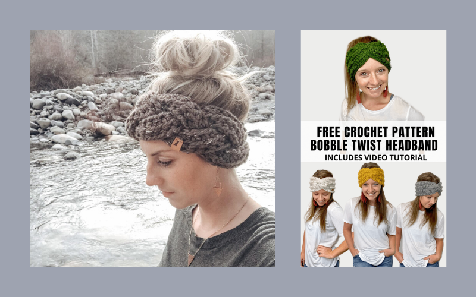

---

type: "post"
title: "Winter Headband Earwarmer Roundup!"
author: "Alaina"
category: "patterns"
date: "2020-01-04"
slug: "/earwarmer-roundup"
postImage: "./img/earwarmer-roundup/list-image.png"
metaDescription: "Looking for a quick project to keep you warm in the winter? Here's a round up of some of my favorite cozy headbands for the colder weather!"

---

When I'm in a crochet rut and I'm looking for a quick project, the first thing I do is look for a new earwarmer pattern. They are almost always super quick, simple, and the odds of me having the yarn and hook sizes I need are high. They are a perfect day or weekend project, and most importantly, they are super practical! As it's currently winter in the Northern Hemisphere, you can find different winter headbands all over the place (which also means they typically sell well at market).

Below you will find some of my favorite free and paid patterns I've stumbled across lately.

I love things that look knit, but are not in fact, knit (I can't knit very well, okay?! Sue me!). This is a gorgeous knit-look [Modern Twist](https://makeanddocrew.com/modern-crochet-twist-headband-free-pattern/) headband made by [Make and Do Crew](https://makeanddocrew.com/). She used the Lion Brand Baby Alpaca Yarn, which if you have never used, be prepared to fall in love.

Next we have one of my **favorite makers of all time** [Megmade with Love](https://megmadewithlove.com) and her [Slopes Headband](https://megmadewithlove.com/blog-2/2018/1/20/new-free-pattern-featuring-the-slopes-headband). There isn't a single thing that I have made from Megmade that I haven't been obsessed with, and this is no exception. I didn't add buttons to mine, and it still looked super cute!

The name of this pattern is [Fave Twist](https://www.mamainastitch.com/golden-fave-twist-headband-free-crochet-pattern/) and it's accurately named. I mean, look at this color. Look at that effortless twist! It's one of those perfect fall - winter - early spring colors that is perfectly transitional and totally functional. Thank you to [Mama in a Stitch](https://www.mamainastitch.com/) for creating this beauty. This is a super easy beginner-friendly project that is equally fast and impressive!

Here we have one of my favorite patterns of all time. The [Kenzie Twisted Earwarmer](https://www.etsy.com/listing/640501512/kenzie-twisted-earwarmer-crochet-pattern?ref=yr_purchases) by [Deni Made Designs](https://www.etsy.com/shop/DeniMadeDesigns) is one of my favorite stitch patterns as well as my favorite way to make a twist that isn't bulky. She also features this same pattern in a [coffee cozy](https://www.etsy.com/listing/736158586/kenzie-twisted-cup-cozy-crochet-pattern?ref=shop_home_feat_3&bes=1) variation, which I have (literally) made dozens of.

This [braided chunky headband](https://www.etsy.com/listing/653617714/headband-pattern-braided-chunky-headband?ref=yr_purchases) by [Wild Sapling](https://www.etsy.com/shop/WildSapling) is one of my favorite things to make for my gal pals. You use a chunky yarn so it works up super fast, and the simple braid looks very impressive. I've made quite a few of these, and they are always a big hit.

Next we have one of the best pattern makers of all time in my humble opinion, [A Crafty Concept](https://www.acraftyconcept.com/), with the [Bobble Twist Headband](https://www.acraftyconcept.com/boho-bobble-twist-headband/). It's not super complicated (I would consider this an advanced beginner/intermediate pattern), but it looks intricate and complex. I also love a wider ear warmer as well, and I find that this is flattering on pretty much anyone! Side note: I have a low key giant head and I had to add quite a few stitches, so make sure you check the size as you go.

An oldie but goody by [Rescued Paw Designs](https://rescuedpawdesigns.com/) this [Chained Earwarmer Headband](https://rescuedpawdesigns.com/chained-crochet-headband-pattern/) is very beginner friendly, and could probably be one of your first, if not your first, project. It's easy, it's adorable, and it's free. What more could you ask for? I love making the little tie a different color for something different and interesting!

Finally, I have the [Braided Cable Ear Warmer](https://www.etsy.com/listing/744501688/braided-cable-ear-warmer-crochet-pattern?ga_order=most_relevant&ga_search_type=all&ga_view_type=gallery&ga_search_query=ear+warmer+crochet+pattern&ref=sr_gallery-1-38&organic_search_click=1) pattern by [Crochet It Creations US](https://crochetitcreations.com/). This is on my list to crochet for obvious reasons. Look at that cable! Oh my goodness, it's so beautiful. I love making items like these in dark colors because even though it's a liiiiitle harder to see the detail from a distance, somehow it makes the closeup even that more stunning.

---
